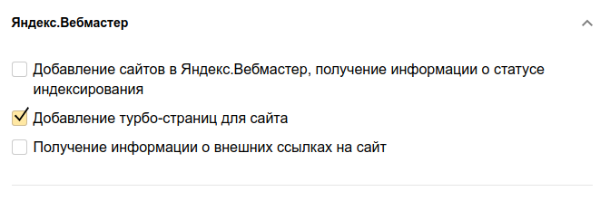

<h2>Config</h2>
1. Get API yandex turbo OAuth token
2. Create application on yandex https://oauth.yandex.ru/client/new

3. Edit admin/config/services/csas-ayt -> Host name
4. Enable admin/config/services/csas-ayt -> API yandex turbo debug
5. For get url once submit admin/config/services/csas-ayt -> Get_url_add_rss_chanel
6. For send submit admin/config/services/csas-ayt -> Upload turbo
7. For check processing submit admin/config/services/csas-ayt -> Task info total
8. For details task status info submit admin/config/services/csas-ayt -> Task info
9. When test success on https://webmaster.yandex.ru/site/https:mySite.ru:443/turbo/sources/ 
Disable admin/config/services/csas-ayt -> API yandex turbo debug
10. Once send admin/config/services/csas-ayt -> Upload turbo batch
11. Check admin/reports/dblog
12. Check status admin/config/services/csas-ayt -> Task info total
13. Check complete & error admin/config/services/csas-ayt -> Task info
14. Finish after some time check https://webmaster.yandex.ru/site/https:mySite.ru:443/turbo/sources/
P.S. For happy process use cron admin/config/services/csas-ayt -> Cron :)  